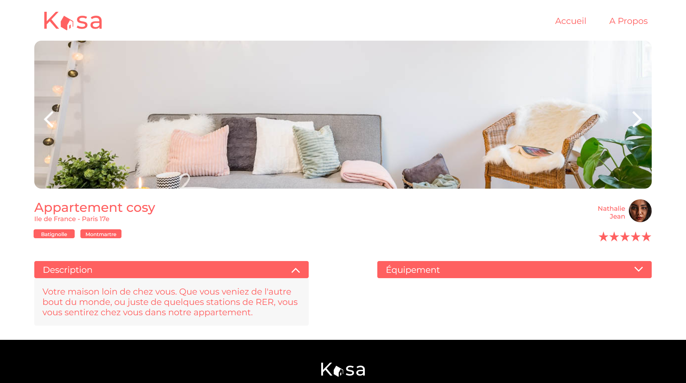

# Kasa 🇫🇷

    Projet 11 de la formation Développeurd'application-JavaScript React | OpenClassrooms 

**Selectionner un appartement**

<kbd></kbd>

> PROBLEMATIQUE
Le site de Kasa, plateforme de location de logements entre particuliers (plus de 500 annonces postées par jour), a été codé il y a plus de 10 ans en ASP.NET avec un code legacy important.

> BESOIN
Refonte totale pour passer à une stack complète en JavaScript avec NodeJS côté Back-end, et React côté Front-end.

## Livrables

> React App
- code React du projet
- code React Router pour les routes dans un fichier dédié

## Compétences développées

- [x] Initialiser une application web avec un framework
- [x] Créer des composants avec React 
- [x] Développer les routes d'une application web avec React Router

## Ressources fournies

- [maquette UI](https://www.figma.com/file/bAnXDNqRKCRRP8mY2gcb5p/UI-Design-Kasa-FR?node-id=4%3A1)
- [coding guidelines](https://course.oc-static.com/projects/Front-End+V2/P9+React+1/Coding+guidelines+Kasa+FR.pdf)
- [base de données](https://s3-eu-west-1.amazonaws.com/course.oc-static.com/projects/Front-End+V2/P9+React+1/logements.json)

### Editeur recommandé

* [Visual Studio code](https://code.visualstudio.com/)

### Prérequis

* [Git](https://git-scm.com/) pour cloner les repos
* [nodeJS](https://nodejs.org/fr/) (version 14.20.1) pour exécuter les commandes
* [npm](https://www.npmjs.com/) (version 6.14.17) pour lancer l'application (front-end)

### Dépendances

* [react-router-dom](https://reactrouter.com/web/guides/quick-start) (version 6.4.2)
* [Prop-types](https://www.npmjs.com/package/prop-types) (version 15.8.1)

### Etape: Lancement du front-end

- Cloner le repo du projet : `gh repo clone AndyRama/AndyRamaroson_11_25112021`
- Aller dans ce dossier : `cd kasa `
- Installer ses dépendances : `npm install`
- Le lancer sur le port 3001 : `npm run start`
- Ouvrez [http://localhost:3000](http://localhost:3000) pour l'afficher dans votre navigateur.

## fonctionnalité à venir

- [ ] Ajouter tout Cover test pour une couverture à 80%
- [ ] Construire le déploiement de l'application

---------------------------

# Kasa eng

    Project 11 of the Application Developer-JavaScript React training | OpenClassrooms

**Select an apartment**

<kbd></kbd>

> ISSUE
The Kasa site, a platform for renting accommodation between individuals (more than 500 ads posted per day), was coded more than 10 years ago in ASP.NET with significant legacy code.

> NEED
Total redesign to move to a full stack in JavaScript with NodeJS on the Back-end side, and React on the Front-end side.

## Deliverables

> React App
- React code of the project
- React Router code for routes in a dedicated file

## Skills developed

- [x] Initialize a web application with a framework
- [x] Create components with React
- [x] Develop the routes of a web application with React Router

## Resources Provided

- [UI design](https://www.figma.com/file/bAnXDNqRKCRRP8mY2gcb5p/UI-Design-Kasa-FR?node-id=4%3A1)
- [coding guidelines](https://course.oc-static.com/projects/Front-End+V2/P9+React+1/Coding+guidelines+Kasa+FR.pdf)
- [database](https://s3-eu-west-1.amazonaws.com/course.oc-static.com/projects/Front-End+V2/P9+React+1/logements.json)

### Recommended editor

* [Visual Studio code](https://code.visualstudio.com/)

### Prerequisites

* [Git](https://git-scm.com/) to clone repos
* [nodeJS](https://nodejs.org/en/) (version 14.20.1) to execute commands
* [npm](https://www.npmjs.com/) (version 6.14.17) to launch the application (front-end)

### Dependencies

* [react-router-dom](https://reactrouter.com/web/guides/quick-start) (version 6.4.2)
* [Prop-types](https://www.npmjs.com/package/prop-types) (version 15.8.1)

### Step: Launching the front-end

- Clone the project repo: `gh repo clone AndyRama/AndyRamaroson_11_25112021`
- Go to this folder: `cd kasa `
- Install its dependencies: `npm install`
- Run it on port 3001: `npm run start`
- Open [http://localhost:3000](http://localhost:3000) to view it in your browser.

## feature coming soon

- [ ] Add all Cover test for 80% coverage
- [ ] Build Application Deployment
